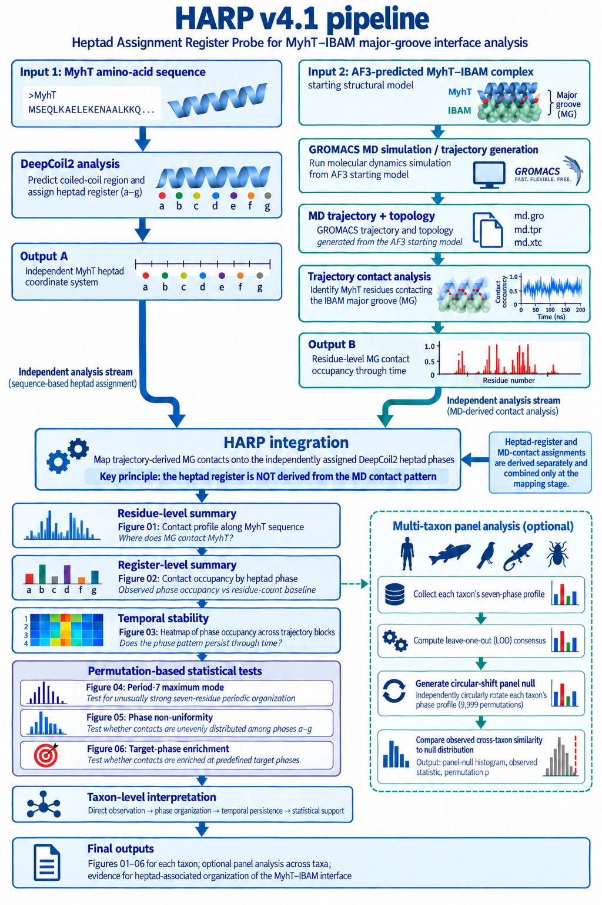

# HARP v4.1 — Heptad Assignment Register Probe

**A reproducible statistical framework for testing molecular-interface
organization relative to an independently defined coiled-coil heptad register**

HARP v4.1 (Heptad Assignment Register Probe) was developed to examine the
molecular interface between the myosin-tail-like coiled-coil region (MyhT) and
the **major groove (MG) of IBAM** (C12orf29; In Between Actin and Myosin).

HARP asks a deliberately narrow question:

> **Are molecular-dynamics-derived MyhT–IBAM MG contacts organized with
> respect to an independently defined MyhT coiled-coil heptad register more
> strongly than expected under explicit null models?**

The central design principle is **independence**:


## HARP v4.1 analysis pipeline



The central design principle is **separate derivation of the two analysis
streams**. DeepCoil2 defines the MyhT heptad coordinate system from sequence,
whereas molecular dynamics determines where and how persistently MyhT contacts
the IBAM major groove. The two assignments are combined only when HARP maps
trajectory-derived contact occupancy onto the preassigned heptad coordinate
system.

**HARP does not derive the heptad register from the contact pattern that it
subsequently tests.**
```

DeepCoil2 defines the MyhT heptad coordinate system. Molecular dynamics
independently determines where and how persistently MyhT contacts the IBAM MG.

**HARP does not derive the heptad register from the contact pattern that it
subsequently tests.**

---

## The analytical problem

Molecular dynamics can show which residues interact and how those interactions
change through time. DeepCoil2 can predict the coiled-coil register of MyhT from sequence,
separately from the MD-derived contact analysis.

Visual inspection can suggest that persistent contacts favour particular
heptad positions.

But visual pattern recognition is not statistical evidence.

HARP distinguishes:

```text
contacts exist
```

from:

```text
contacts exhibit reproducible organization
relative to an independently defined heptad coordinate system
```

It maps trajectory-derived contact information onto the independently assigned
MyhT heptad register and tests the resulting organization against explicit
null models.

---

# The null hypothesis — A BLACK CAT SAT ON THE MAT

Null models can sound considerably more mysterious than they need to.

Consider a seven-word observation:

```text
A     BLACK     CAT     SAT     ON     THE     MAT
1       2        3       4      5       6       7
```

The seven unique components form a recognizable arrangement:

> **A BLACK CAT SAT ON THE MAT**

Now perform a **Cat Shuffle**.

Keep every word exactly once, but disrupt their observed arrangement:

```text
OBSERVED

A     BLACK     CAT     SAT     ON     THE     MAT

                         │
                         │  CAT SHUFFLE
                         │
                         │  preserve the seven pieces
                         │  disrupt their arrangement
                         ▼

MAT   ON        BLACK   A       THE    CAT     SAT

SAT   MAT       THE     BLACK   CAT    A       ON

THE   CAT       ON      MAT     A      SAT     BLACK

                         ⋮
```

Every shuffled realization still contains exactly the same seven words.

Nothing has been added. Nothing has been removed.

**What has been disrupted is their organization.**

Suppose we repeat the Cat Shuffle thousands of times and calculate a statistic
measuring the type of organization present in the original arrangement.

The null-hypothesis question becomes:

> **How often can we disrupt the observed organization, while preserving the
> underlying components, and nevertheless obtain a pattern at least as strong
> as the one we actually observed?**

That is the essential logic behind HARP's permutation tests.

### Preserve the cat. Shuffle the arrangement. Test the pattern.

A useful null model preserves the properties that are **not** being tested
while disrupting the relationship that **is** being tested.

The seven unique words also provide an intuitive parallel to the seven-state
heptad coordinate system:

```text
sentence positions:    1  2  3  4  5  6  7
heptad positions:      a  b  c  d  e  f  g
```

The Cat Shuffle is an analogy, not a literal representation of HARP's
algorithms. Taxon-level and panel-level null models preserve different
properties according to the hypothesis being tested.

The shared principle is:

> **Preserve what the null should preserve. Break the proposed organization.
> Ask how often an equally strong pattern survives.**

Formal definitions are given in the **HARP v4.1 Mathematical Supplement**.

---

## How HARP works

At the individual-taxon level:

```text
GROMACS trajectory + topology
            │
            ▼
trajectory-derived
MyhT–IBAM MG contacts
            │
            │             DeepCoil2
            │             MyhT register
            │                  │
            └────────┬─────────┘
                     ▼
              heptad mapping
                     │
                     ▼
               phase profile
                     │
                     ▼
            taxon-level null
                     │
                     ▼
                 inference
```

HARP combines trajectory-derived contact occupancy with the independently
assigned MyhT heptad register and asks whether the observed phase organization
is stronger than expected under its taxon-level null models.

Across taxa, HARP asks whether those phase signatures share a common
orientation:

```text
taxon phase signatures
          │
          ▼
leave-one-out consensus
          │
          ▼
shared phase alignment
          │
          ▼
independent circular
rotation of each taxon
          │
          ▼
panel null distribution
          │
          ▼
panel-level inference
```

For each taxon, the consensus is constructed from the **other** taxa before
that taxon is compared with it.

For the panel null, each taxon's complete seven-state signature is preserved
but independently circularly rotated:

```text
observed:
0  1  2  3  4  5  6

possible rotations:
1  2  3  4  5  6  0
2  3  4  5  6  0  1
3  4  5  6  0  1  2
...
6  0  1  2  3  4  5
```

The internal shape of each signature survives. Its shared orientation relative
to the other taxa does not.

The panel test therefore asks:

> **Is the observed cross-taxon phase alignment stronger than expected when
> every taxon retains its own seven-state pattern but their common orientation
> is independently disrupted?**

For a practical guide to HARP's six principal graphical outputs, see
`docs/Interpreting HARP v4.1 graphical output.pdf`.

---

## Secondary QC

Production inference uses:

```text
block_size = 4
```

A separate sensitivity analysis tests contiguous block sizes 1–7 without
post-hoc optimization.

In the frozen 26-taxon reference panel, 23/26 taxa remained stable across the
reporting threshold. **Branchiostoma, Octopus and Naegleria** were flagged for
review. Panel invariance passed.

The production block size remains 4.

See `qc/blocksize_sensitivity/README.md` for the full procedure and
interpretation.

---

# Frozen 26-taxon reference dataset

The HARP v4.1 reference panel contains **26 taxa** and **104 scientific input
files** (~19 GB).

The frozen corpus is archived separately on Zenodo:

**DOI:** [10.5281/zenodo.21967201](https://doi.org/10.5281/zenodo.21967201)

Each taxon contains:

```text
md.tpr
md.xtc
myht.fa
myht.out
```

GitHub contains the HARP source, authoritative reference configurations,
canonical taxon roster and SHA-256 inventory. Zenodo contains the heavyweight
scientific payload.

That separation is deliberate.

---

# Getting HARP running

HARP v4.1 was developed and frozen under **Linux using Bash, Conda and
Python 3.11**.

## 1. Clone and create the environment

```bash
git clone https://github.com/thorfriisphd-rgb/HARP-analysis-tool.git
cd HARP-analysis-tool

conda env create -f environment.yml
conda activate harp41
python -m pip install -e .
```

Check the installation:

```bash
harp --help
```

---

## 2. Obtain the reference data

Download the frozen reference archive from Zenodo:

**DOI:** `10.5281/zenodo.21967201`

Files:

```text
HARP_v4.1_26taxa_reference_inputs_20260816.tar
HARP_v4.1_26taxa_reference_inputs_20260816.tar.sha256
```

Verify the archive before extraction:

```bash
sha256sum -c HARP_v4.1_26taxa_reference_inputs_20260816.tar.sha256
```

Extract it:

```bash
tar -xf HARP_v4.1_26taxa_reference_inputs_20260816.tar
```

Point HARP directly to the extracted `26taxa/` scientific payload:

```bash
export HARP_REFERENCE_DATA_ROOT="/path/to/HARP_v4.1_Zenodo_input_26taxa_20260816/26taxa"
```

Check that HARP can see all 26 taxon directories:

```bash
find "$HARP_REFERENCE_DATA_ROOT" \
  -mindepth 1 -maxdepth 1 -type d | wc -l
```

Expected:

```text
26
```

---

## 3. Preflight

From the repository root:

```bash
./run_reference_26taxa.sh preflight
```

Preflight checks:

- corpus structure;
- the canonical SHA-256 inventory;
- all 26 trajectories independently with MDAnalysis;
- the authoritative reference configurations; and
- the packaged pytest suite.

A successful run ends with:

```text
26-taxon reference preflight: PASS
Frozen scientific inputs remained SHA-256 identical.
```

Do not proceed if preflight reports an integrity failure.

---

## 4. Reproduce the frozen analysis

```bash
./run_reference_26taxa.sh all
```

The canonical HARP v4.1 n=26 result is:

```text
observed      0.645128594598065
p-value       0.0001
null mean    -0.000521984561169
null SD       0.151023083942446
null q95      0.225049488444680
permutations  9999
seed          20260801
```

The runner treats these values as a **frozen numerical regression gate**.

They are verification metadata; they do not enter the scientific calculation.

Outputs are written to timestamped result directories rather than silently
overwriting previous analyses.

---

## Documentation

**Graphical interpretation**

`docs/Interpreting HARP v4.1 graphical output.pdf`

Start here to understand HARP's six principal graphical outputs and how they
fit together.

**Mathematical Supplement**

`docs/HARP_v4_1_Mathematical_Supplement.pdf`

Formal definitions of the statistics, null models, phase representations,
permutation inference and panel analysis.

**Reference dataset**

`reference/26taxa/README.md`

Reference-corpus verification and connection to the external Zenodo payload.

**Block-size sensitivity QC**

`qc/blocksize_sensitivity/README.md`

Secondary robustness analysis around the frozen production block size.

**Technical reference**

`docs/HARP_v4.1_Technical_README.md`

CLI commands, validation behaviour, outputs, reference-runner details and frozen benchmark information.

**Release notes**

`RELEASE_NOTES.md`

Summary of the v4.1 release consolidation and freeze.

---

## Repository layout

```text
HARP-analysis-tool/
├── README.md
├── RELEASE_NOTES.md
├── LICENSE
├── environment.yml
├── pyproject.toml
├── run_reference_26taxa.sh
│
├── src/
│   └── harp/
│
├── tests/
│
├── examples/
│
├── docs/
│   ├── HARP_v4.1_pipeline_overview.png
│   ├── HARP_v4_1_Mathematical_Supplement.pdf
│   └── Interpreting HARP v4.1 graphical output.pdf
│
├── reference/
│   ├── configs/
│   │   └── 26taxa/
│   └── 26taxa/
│       ├── README.md
│       ├── taxa.txt
│       └── HARP_v4.1_26taxa_input_sha256.tsv
│
└── qc/
    └── blocksize_sensitivity/
        ├── README.md
        ├── qc_blocksize_sensitivity.sh
        ├── check_panel_invariance.py
        └── runs/
```

Large trajectories and completed analytical run directories are not part of
the source repository.

---

## Scope

HARP tests statistical organization of trajectory-derived molecular contacts
relative to an independently defined heptad register.

It does not by itself establish:

- biochemical mechanism;
- binding affinity;
- evolutionary causation;
- phylogenetic independence;
- functional necessity.

Those questions require independent evidence.

HARP's job is narrower: to make a proposed relationship between molecular
contact organization and an independently defined periodic coordinate system
**explicit, testable, reproducible and falsifiable**.

---

## Citation

If HARP contributes to published work, please cite:

**Friis TE.** C12orf29 encodes IBAM (In Between Actin and Myosin), a conserved
actomyosin-associated protein exhibiting deeply conserved interaction grammar
across eukaryotic evolution. *Manuscript in preparation.*

When reproducing or reusing the frozen reference corpus, also cite:

**HARP v4.1 — 26-taxon reference input dataset**
Zenodo
DOI: `10.5281/zenodo.21967201`

---

## Licence

HARP v4.1 is released under the [MIT License](LICENSE).

---

## Author

**Thor Einar Friis, PhD**

[](https://orcid.org/0000-0002-4132-4912)

Independent researcher, Bodø, Norway.
PhD in Molecular Biology, Queensland University of Technology (QUT).

HARP forms part of a reproducible computational framework developed for the
investigation of IBAM/C12orf29 and the MyhT–IBAM major-groove interface.
